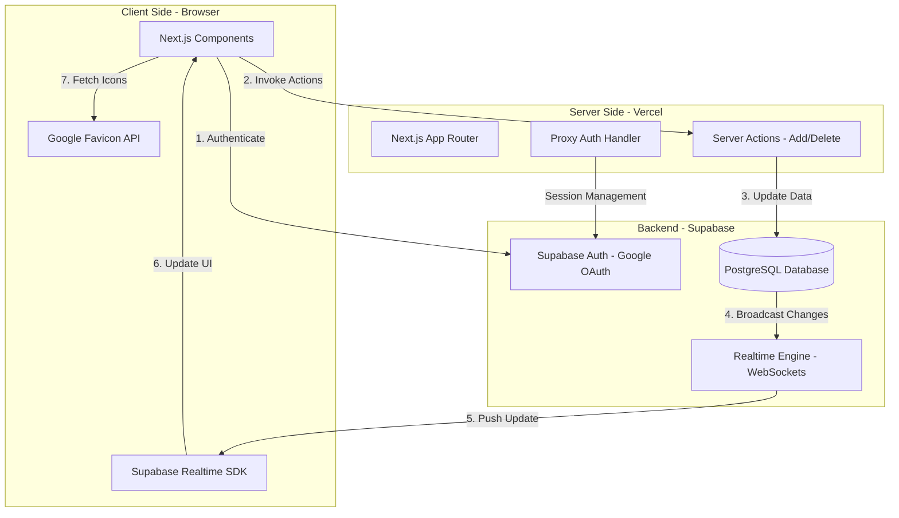

# 🚀 Smart Bookmark App

A professional, high-performance web application designed for secure, real-time link management. Built with **Next.js 16**, **Supabase**, and **Tailwind CSS v4**, this app serves as a personal vault for your digital library.

## ✨ Features

* **Real-time Synchronization**: Powered by Supabase Realtime; bookmarks added or deleted in one tab appear instantly in all others without a page refresh.
* **Optimistic UI**: Deletions feel instantaneous thanks to React 19's `useOptimistic` hook.
* **Secure Authentication**: Integrated Google OAuth via Supabase Auth for a seamless and secure login experience.
* **Dynamic Favicons**: Automatically fetches high-quality website icons using Google's Favicon API for an intuitive visual experience.
* **Modern UI/UX**: A sleek, dark-themed interface built with Tailwind CSS v4 featuring glassmorphism and responsive grid layouts.
* **Server-Side Security**: Protected database access using Row-Level Security (RLS) and Server Actions.

## 🛠️ Tech Stack

* **Framework**: Next.js 16 (App Router)
* **Database & Auth**: Supabase (Postgres + Auth + Realtime)
* **Styling**: Tailwind CSS v4
* **Icons**: Lucide React
* **Validation**: Zod
  


## Challenges

* **Next.js 16 Migration**: Adapting to the architectural shifts in Next.js 16.1.6, which required transitioning authentication session handling from the `middleware` file convention to the new `proxy` system to maintain framework compatibility.
* **Real-time Synchronization**: Implementing Supabase Realtime listeners within the `BookmarkList` component to ensure a live feed, which required managing explicit type safety for incoming data payloads and synchronizing client-side state with server-side revalidations.

## 🚀 Getting Started

### Prerequisites
* Node.js 18+
* A Supabase Project
* Google Cloud Console Project (for OAuth)

### Installation
1.  **Clone the repository**:
    ```bash
    git clone [https://github.com/Bala-s-dev/smart-bookmark-app.git](https://github.com/Bala-s-dev/smart-bookmark-app.git)
    cd smart-bookmark-app
    ```
2.  **Install dependencies**:
    ```bash
    npm install
    ```
3.  **Setup Environment Variables**:
    Create a `.env.local` file and add:
    ```env
    NEXT_PUBLIC_SUPABASE_URL=your_supabase_url
    NEXT_PUBLIC_SUPABASE_ANON_KEY=your_supabase_anon_key
    ```
4.  **Database Setup**:
    Run the following SQL in your Supabase Editor to enable Realtime:
    ```sql
    -- Enable Realtime for the table
    ALTER PUBLICATION supabase_realtime ADD TABLE bookmarks;

    -- Ensure IDs are sent for deletions
    ALTER TABLE bookmarks REPLICA IDENTITY FULL;
    ```
5.  **Run Development Server**:
    ```bash
    npm run dev
    ```

